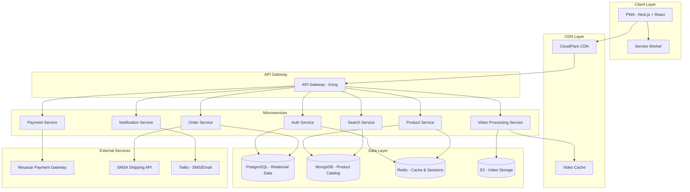

# Design Document: WISAL E-Commerce Platform

## Overview

WISAL is a modern, video-first e-commerce marketplace for Saudi Arabia that combines traditional e-commerce functionality with innovative short-form video product discovery. The platform enables sellers to showcase products through engaging 15-60 second videos while buyers discover and purchase through an immersive TikTok/Reels-style interface alongside conventional category browsing.

The system is built as a Progressive Web App (PWA) that can be installed directly from the browser on both iOS and Android devices, eliminating app store dependencies. Full bilingual support (English/Arabic) with proper RTL layout ensures accessibility for the Saudi market.

### Key Design Principles

1. **Video-First Experience**: Product videos are the primary discovery mechanism, optimized for mobile viewing
2. **Progressive Enhancement**: Core functionality works offline through PWA capabilities
3. **Bilingual by Design**: All interfaces support seamless English/Arabic switching with RTL layout
4. **Performance-Optimized**: Sub-2-second load times with adaptive video streaming
5. **Scalable Architecture**: Microservices-based backend supporting 100,000+ concurrent users
6. **Saudi Market Focus**: Local payment methods, shipping providers, and cultural design sensibilities

## Architecture

### High-Level Architecture



### Technology Stack

**Frontend:**
- **Framework**: Next.js 14+ (React 18+) with App Router
- **Language**: TypeScript
- **Styling**: Tailwind CSS with RTL support
- **State Management**: Zustand for global state, React Query for server state
- **Internationalization**: next-i18next for bilingual support
- **PWA**: next-pwa for service worker and offline capabilities
- **Video Player**: Video.js with HLS.js for adaptive streaming
- **UI Components**: Radix UI primitives with custom styling

**Backend:**
- **Runtime**: Node.js 20+ with TypeScript
- **Framework**: Express.js for REST APIs
- **API Gateway**: Kong for routing, rate limiting, authentication
- **Microservices Communication**: REST APIs with Redis pub/sub for events

**Databases:**
- **PostgreSQL**: User accounts, orders, transactions, seller data
- **MongoDB**: Product catalog, reviews, analytics
- **Redis**: Session management, caching, real-time data, pub/sub

**Video Infrastructure:**
- **Storage**: AWS S3 or compatible object storage
- **Processing**: FFmpeg for transcoding
- **CDN**: CloudFlare for global video delivery
- **Streaming**: HLS (HTTP Live Streaming) with adaptive bitrate

**Payment Integration:**
- **Primary**: Moyasar (Saudi-focused payment gateway)
- **Supported Methods**: Mada, Visa, Mastercard, Apple Pay, STC Pay

**Deployment:**
- **Hosting**: AWS or DigitalOcean
- **Containers**: Docker with Docker Compose for development
- **Orchestration**: Kubernetes for production (optional, can start with Docker Swarm)
- **CI/CD**: GitHub Actions

## Components and Interfaces

### Frontend Components

#### 1. Navigation System

**Bottom Navigation Bar**
- Five main tabs: Home, Categories, Videos, Cart, Profile
- Active state highlighting
- Badge notifications for Cart and Profile
- Smooth transitions between pages
- Persistent across page navigation

```typescript
interface NavigationItem {
  id: 'home' | 'categories' | 'videos' | 'cart' | 'profile';
  label: string;
  labelAr: string;
  icon: React.ComponentType;
  badge?: number;
  path: string;
}
```

#### 2. Home Page Components

**Hero Banner Carousel**
- Auto-rotating promotional banners
- Touch/swipe navigation
- Deep links to products or categories
- Lazy-loaded images

**Category Quick Access**
- Grid of category tiles with icons
- Localized category names
- Navigation to category page

**Product Card Grid**
- Reusable product card component
- Thumbnail, name, price, rating
- Add to cart quick action
- Favorite toggle

**Trending/Flash Deals Sections**
- Horizontal scrollable product lists
- Countdown timers for flash deals
- Infinite scroll or pagination

```typescript
interface ProductCard {
  id: string;
  name: string;
  nameAr: string;
  price: number;
  originalPrice?: number;
  currency: 'SAR';
  thumbnail: string;
  videoUrl?: string;
  rating: number;
  reviewCount: number;
  sellerId: string;
  sellerName: string;
  inStock: boolean;
  badge?: 'new' | 'sale' | 'trending';
}
```

#### 3. Category Page Components

**Category Tree Navigation**
- Hierarchical category display
- Breadcrumb navigation
- Expandable subcategories

**Filter Panel**
- Price range slider
- Brand/seller checkboxes
- Rating filter
- Availability toggle
- Clear filters button

**Sort Options**
- Relevance, Price (low-high, high-low), Newest, Popularity
- Dropdown or bottom sheet on mobile

**Product Grid/List View**
- Toggle between grid and list layouts
- Responsive grid (2 columns mobile, 4+ desktop)
- Infinite scroll with loading states

#### 4. Video Feed Components

**Vertical Video Player**
- Full-screen vertical video display
- Auto-play with loop
- Tap to pause/play
- Swipe up/down for next/previous video
- Preloading next 2-3 videos

**Video Overlay UI**
- Product information (name, price, seller)
- Action buttons (Add to Cart, View Details, Favorite)
- Engagement metrics (views, likes)
- Category filter button
- Mute/unmute toggle

```typescript
interface VideoFeedItem {
  id: string;
  productId: string;
  videoUrl: string;
  hlsUrl: string;
  thumbnail: string;
  product: ProductCard;
  views: number;
  likes: number;
  duration: number;
}
```

#### 5. Cart Page Components

**Cart Item List**
- Product thumbnail and details
- Quantity controls (increment/decrement)
- Remove item button
- Stock availability indicator
- Subtotal per item

**Cart Summary**
- Subtotal
- Shipping estimate
- Discount code input
- Total price
- Proceed to Checkout button

**Empty Cart State**
- Illustration
- Call-to-action to browse products

```typescript
interface CartItem {
  id: string;
  productId: string;
  name: string;
  nameAr: string;
  thumbnail: string;
  price: number;
  quantity: number;
  maxQuantity: number;
  sellerId: string;
  sellerName: string;
}

interface Cart {
  items: CartItem[];
  subtotal: number;
  shipping: number;
  discount: number;
  total: number;
  currency: 'SAR';
}
```

#### 6. Profile Page Components

**User Info Section**
- Profile picture
- Name, email, phone
- Edit profile button

**Menu Items**
- Orders
- Favorites/Wishlist
- Addresses
- Payment Methods
- Notifications Settings
- Language Selection
- Help & Support
- Logout

**Order History List**
- Order cards with status
- Order number, date, total
- Quick reorder action

#### 7. Product Detail Page Components

**Video Gallery**
- Primary video player
- Thumbnail carousel for multiple videos
- Fullscreen mode

**Product Information**
- Name, price, rating
- Seller information with link to store
- Detailed description
- Specifications table
- Stock status

**Action Buttons**
- Add to Cart
- Buy Now
- Add to Favorites
- Share

**Reviews Section**
- Rating breakdown
- Review list with pagination
- Photo/video reviews
- Write review button (for verified buyers)

**Related Products**
- Horizontal scrollable product cards

#### 8. Checkout Flow Components

**Address Selection**
- Saved addresses list
- Add new address form
- Set as default option

**Shipping Method Selection**
- Standard, Express, Same-day options
- Delivery time estimates
- Shipping costs

**Payment Method Selection**
- Saved cards
- New card form
- Digital wallet options (Apple Pay, STC Pay)
- Mada card support

**Order Review**
- Complete order summary
- Edit options for address/shipping/payment
- Terms and conditions checkbox
- Place Order button

#### 9. Seller Portal Components

**Dashboard**
- Sales overview (today, week, month)
- Recent orders
- Product performance metrics
- Quick actions

**Product Management**
- Product list with search/filter
- Add/Edit product form
- Video upload interface
- Inventory management
- Bulk actions

**Order Management**
- Order list with filters (pending, processing, shipped, delivered)
- Order detail view
- Status update controls
- Shipping label generation

**Analytics**
- Revenue charts
- Product performance table
- Customer demographics
- Video engagement metrics

### Backend Services

#### 1. Authentication Service

**Responsibilities:**
- User registration and login
- JWT token generation and validation
- Password reset flow
- OAuth integration (Google, Apple)
- Role-based access control (buyer, seller, admin)

**API Endpoints:**
```
POST /api/auth/register
POST /api/auth/login
POST /api/auth/logout
POST /api/auth/refresh-token
POST /api/auth/forgot-password
POST /api/auth/reset-password
POST /api/auth/verify-email
POST /api/auth/oauth/google
POST /api/auth/oauth/apple
```

**Database Schema (PostgreSQL):**
```sql
CREATE TABLE users (
  id UUID PRIMARY KEY,
  email VARCHAR(255) UNIQUE NOT NULL,
  phone VARCHAR(20) UNIQUE,
  password_hash VARCHAR(255),
  role VARCHAR(20) NOT NULL,
  email_verified BOOLEAN DEFAULT FALSE,
  phone_verified BOOLEAN DEFAULT FALSE,
  created_at TIMESTAMP DEFAULT NOW(),
  updated_at TIMESTAMP DEFAULT NOW()
);

CREATE TABLE user_profiles (
  user_id UUID PRIMARY KEY REFERENCES users(id),
  first_name VARCHAR(100),
  last_name VARCHAR(100),
  profile_picture_url TEXT,
  preferred_language VARCHAR(5) DEFAULT 'en',
  created_at TIMESTAMP DEFAULT NOW(),
  updated_at TIMESTAMP DEFAULT NOW()
);
```

#### 2. Product Service

**Responsibilities:**
- Product CRUD operations
- Category management
- Inventory tracking
- Product search and filtering
- Related products recommendations

**API Endpoints:**
```
GET /api/products
GET /api/products/:id
POST /api/products (seller only)
PUT /api/products/:id (seller only)
DELETE /api/products/:id (seller only)
GET /api/products/search
GET /api/products/category/:categoryId
GET /api/products/:id/related
GET /api/categories
POST /api/categories (admin only)
```

**Database Schema (MongoDB):**
```javascript
{
  _id: ObjectId,
  name: String,
  nameAr: String,
  description: String,
  descriptionAr: String,
  price: Number,
  originalPrice: Number,
  currency: String,
  sellerId: String,
  sellerName: String,
  categoryId: String,
  categoryPath: [String],
  videos: [{
    url: String,
    hlsUrl: String,
    thumbnail: String,
    duration: Number,
    order: Number
  }],
  specifications: [{
    key: String,
    keyAr: String,
    value: String,
    valueAr: String
  }],
  inventory: {
    quantity: Number,
    lowStockThreshold: Number,
    inStock: Boolean
  },
  rating: {
    average: Number,
    count: Number
  },
  tags: [String],
  status: String, // 'active', 'inactive', 'pending'
  createdAt: Date,
  updatedAt: Date
}
```

#### 3. Video Processing Service

**Responsibilities:**
- Video upload handling
- Video transcoding to multiple resolutions
- HLS manifest generation
- Thumbnail extraction
- Video compression and optimization
- CDN upload

**Processing Pipeline:**
1. Receive video upload
2. Validate format and duration
3. Extract thumbnail at 2-second mark
4. Transcode to 480p, 720p, 1080p
5. Generate HLS playlist (.m3u8)
6. Upload to S3/CDN
7. Update product record with video URLs
8. Notify seller of completion

**API Endpoints:**
```
POST /api/videos/upload
GET /api/videos/:id/status
DELETE /api/videos/:id
POST /api/videos/:id/regenerate-thumbnail
```

**Video Storage Structure:**
```
/videos/{productId}/{videoId}/
  - original.mp4
  - thumbnail.jpg
  - 480p.m3u8
  - 480p_segment_*.ts
  - 720p.m3u8
  - 720p_segment_*.ts
  - 1080p.m3u8
  - 1080p_segment_*.ts
  - master.m3u8
```

#### 4. Order Service

**Responsibilities:**
- Order creation and management
- Order status tracking
- Order history
- Shipping integration
- Return and refund processing

**API Endpoints:**
```
POST /api/orders
GET /api/orders
GET /api/orders/:id
PUT /api/orders/:id/status (seller only)
POST /api/orders/:id/cancel
POST /api/orders/:id/return
GET /api/orders/seller/:sellerId (seller only)
```

**Database Schema (PostgreSQL):**
```sql
CREATE TABLE orders (
  id UUID PRIMARY KEY,
  order_number VARCHAR(50) UNIQUE NOT NULL,
  buyer_id UUID REFERENCES users(id),
  seller_id UUID REFERENCES users(id),
  status VARCHAR(50) NOT NULL,
  subtotal DECIMAL(10,2) NOT NULL,
  shipping_cost DECIMAL(10,2) NOT NULL,
  discount DECIMAL(10,2) DEFAULT 0,
  total DECIMAL(10,2) NOT NULL,
  currency VARCHAR(3) DEFAULT 'SAR',
  shipping_address JSONB NOT NULL,
  tracking_number VARCHAR(100),
  estimated_delivery DATE,
  created_at TIMESTAMP DEFAULT NOW(),
  updated_at TIMESTAMP DEFAULT NOW()
);

CREATE TABLE order_items (
  id UUID PRIMARY KEY,
  order_id UUID REFERENCES orders(id),
  product_id VARCHAR(50) NOT NULL,
  product_name VARCHAR(255) NOT NULL,
  product_name_ar VARCHAR(255),
  quantity INTEGER NOT NULL,
  unit_price DECIMAL(10,2) NOT NULL,
  subtotal DECIMAL(10,2) NOT NULL,
  created_at TIMESTAMP DEFAULT NOW()
);
```

#### 5. Payment Service

**Responsibilities:**
- Payment processing via Moyasar
- Payment method management
- Transaction recording
- Refund processing
- Payment verification

**API Endpoints:**
```
POST /api/payments/create-intent
POST /api/payments/confirm
POST /api/payments/refund
GET /api/payments/:id
GET /api/payments/methods
POST /api/payments/methods
DELETE /api/payments/methods/:id
POST /api/payments/webhook (Moyasar callback)
```

**Moyasar Integration:**
```typescript
interface MoyasarPaymentRequest {
  amount: number; // in halalas (1 SAR = 100 halalas)
  currency: 'SAR';
  description: string;
  callback_url: string;
  source: {
    type: 'creditcard' | 'applepay' | 'stcpay';
    number?: string;
    cvc?: string;
    month?: string;
    year?: string;
    name?: string;
  };
}
```

**Database Schema (PostgreSQL):**
```sql
CREATE TABLE transactions (
  id UUID PRIMARY KEY,
  order_id UUID REFERENCES orders(id),
  moyasar_payment_id VARCHAR(100) UNIQUE,
  amount DECIMAL(10,2) NOT NULL,
  currency VARCHAR(3) DEFAULT 'SAR',
  status VARCHAR(50) NOT NULL,
  payment_method VARCHAR(50),
  created_at TIMESTAMP DEFAULT NOW(),
  updated_at TIMESTAMP DEFAULT NOW()
);
```

#### 6. Search Service

**Responsibilities:**
- Full-text search across products
- Autocomplete suggestions
- Search result ranking
- Filter and sort operations
- Search analytics

**Technology:**
- MongoDB text indexes for basic search
- Consider Elasticsearch for advanced search (future enhancement)

**API Endpoints:**
```
GET /api/search?q={query}&category={id}&minPrice={n}&maxPrice={n}&sort={field}
GET /api/search/suggestions?q={query}
GET /api/search/trending
```

**Search Index (MongoDB):**
```javascript
db.products.createIndex({
  name: "text",
  nameAr: "text",
  description: "text",
  descriptionAr: "text",
  tags: "text"
}, {
  weights: {
    name: 10,
    nameAr: 10,
    tags: 5,
    description: 1,
    descriptionAr: 1
  }
});
```

#### 7. Notification Service

**Responsibilities:**
- Push notifications (PWA)
- Email notifications
- SMS notifications
- In-app notifications
- Notification preferences management

**API Endpoints:**
```
POST /api/notifications/subscribe
POST /api/notifications/send
GET /api/notifications
PUT /api/notifications/:id/read
GET /api/notifications/preferences
PUT /api/notifications/preferences
```

**Notification Types:**
- Order confirmation
- Order status updates
- Shipping updates
- Delivery confirmation
- Promotional messages
- Price drop alerts
- Restock alerts

**Integration:**
- **Push**: Web Push API for PWA
- **Email**: SendGrid or AWS SES
- **SMS**: Twilio

## Data Models

### Core Entities

#### User
```typescript
interface User {
  id: string;
  email: string;
  phone?: string;
  role: 'buyer' | 'seller' | 'admin';
  profile: UserProfile;
  emailVerified: boolean;
  phoneVerified: boolean;
  createdAt: Date;
  updatedAt: Date;
}

interface UserProfile {
  firstName: string;
  lastName: string;
  profilePicture?: string;
  preferredLanguage: 'en' | 'ar';
  addresses: Address[];
  paymentMethods: PaymentMethod[];
}

interface Address {
  id: string;
  type: 'home' | 'work' | 'other';
  street: string;
  city: string;
  province: string;
  postalCode: string;
  country: string;
  isDefault: boolean;
}
```

#### Product
```typescript
interface Product {
  id: string;
  name: string;
  nameAr: string;
  description: string;
  descriptionAr: string;
  price: number;
  originalPrice?: number;
  currency: 'SAR';
  sellerId: string;
  sellerName: string;
  categoryId: string;
  categoryPath: string[];
  videos: ProductVideo[];
  specifications: Specification[];
  inventory: Inventory;
  rating: Rating;
  tags: string[];
  status: 'active' | 'inactive' | 'pending';
  createdAt: Date;
  updatedAt: Date;
}

interface ProductVideo {
  id: string;
  url: string;
  hlsUrl: string;
  thumbnail: string;
  duration: number;
  order: number;
  views: number;
  likes: number;
}

interface Specification {
  key: string;
  keyAr: string;
  value: string;
  valueAr: string;
}

interface Inventory {
  quantity: number;
  lowStockThreshold: number;
  inStock: boolean;
}

interface Rating {
  average: number;
  count: number;
}
```

#### Order
```typescript
interface Order {
  id: string;
  orderNumber: string;
  buyerId: string;
  sellerId: string;
  status: OrderStatus;
  items: OrderItem[];
  subtotal: number;
  shippingCost: number;
  discount: number;
  total: number;
  currency: 'SAR';
  shippingAddress: Address;
  trackingNumber?: string;
  estimatedDelivery?: Date;
  createdAt: Date;
  updatedAt: Date;
}

type OrderStatus = 
  | 'pending'
  | 'confirmed'
  | 'processing'
  | 'shipped'
  | 'delivered'
  | 'cancelled'
  | 'returned';

interface OrderItem {
  id: string;
  productId: string;
  productName: string;
  productNameAr: string;
  quantity: number;
  unitPrice: number;
  subtotal: number;
}
```

#### Review
```typescript
interface Review {
  id: string;
  productId: string;
  userId: string;
  userName: string;
  orderId: string;
  rating: number; // 1-5
  title?: string;
  comment?: string;
  media: ReviewMedia[];
  helpful: number;
  verified: boolean;
  createdAt: Date;
}

interface ReviewMedia {
  type: 'image' | 'video';
  url: string;
  thumbnail?: string;
}
```

## Correctness Properties

A property is a characteristic or behavior that should hold true across all valid executions of a system—essentially, a formal statement about what the system should do. Properties serve as the bridge between human-readable specifications and machine-verifiable correctness guarantees.

### Property 1: User Registration Creates Valid Accounts
*For any* valid user registration data (email, phone, password), the system should create a user account with proper verification status and return a success confirmation.
**Validates: Requirements 1.1**

### Property 2: Authentication Establishes Sessions for Valid Credentials
*For any* user with valid credentials, logging in should establish a secure session with a valid JWT token and proper expiration time.
**Validates: Requirements 1.2**

### Property 3: Invalid Credentials Are Rejected
*For any* invalid credential combination (wrong password, non-existent email, malformed input), the authentication system should reject the login attempt and return an appropriate error message.
**Validates: Requirements 1.3**

### Property 4: Expired Sessions Require Re-authentication
*For any* expired session token, attempting to perform sensitive operations should be rejected and prompt re-authentication.
**Validates: Requirements 1.7**

### Property 5: Video Feed Displays Required Product Information
*For any* product video in the feed, the overlay UI should display product name, price, seller name, and all action buttons.
**Validates: Requirements 2.3**

### Property 6: Video Format Validation
*For any* uploaded video file, the system should accept only valid formats (MP4, MOV, WebM) and reject all other formats with a clear error message.
**Validates: Requirements 3.1**

### Property 7: Video Encoding Produces Multiple Resolutions
*For any* successfully uploaded video, the encoding process should produce output files in 480p, 720p, and 1080p resolutions with valid HLS manifests.
**Validates: Requirements 3.3**

### Property 8: Product Creation Requires All Mandatory Fields
*For any* product submission, the system should reject products missing required fields (name, description, price, category, or video) and accept only complete products.
**Validates: Requirements 4.3**

### Property 9: Out-of-Stock Products Are Marked Unavailable
*For any* product where inventory quantity reaches zero, the system should automatically mark it as unavailable in the feed and prevent new purchases.
**Validates: Requirements 4.5**

### Property 10: Cart Operations Maintain Consistency
*For any* sequence of cart operations (add, remove, update quantity), the cart state should remain consistent with the total price correctly calculated and item counts accurate.
**Validates: Requirements 5.1, 5.4**

### Property 11: Successful Payments Create Orders
*For any* successful payment transaction, the system should create an order record with a unique order number and send confirmations to both buyer and seller.
**Validates: Requirements 5.8**

### Property 12: Order Status Changes Trigger Notifications
*For any* order status change, the notification system should send appropriate notifications to the buyer through their preferred channels.
**Validates: Requirements 7.3, 11.1**

### Property 13: Search Returns Relevant Results
*For any* search query (English or Arabic), the search engine should return only products that match the query in name, description, or seller name, ranked by relevance.
**Validates: Requirements 8.1, 8.2, 8.3**

### Property 14: Language Selection Changes Layout Direction
*For any* user selecting Arabic language, the entire interface should switch to RTL layout, and selecting English should switch to LTR layout.
**Validates: Requirements 9.2**

### Property 15: All UI Strings Have Translations
*For any* UI string in the application, there should exist a corresponding translation in both English and Arabic.
**Validates: Requirements 9.1**

### Property 16: Offline Mode Serves Cached Content
*For any* previously viewed product, the PWA should be able to display that product's information when offline using cached data.
**Validates: Requirements 10.3**

### Property 17: Duplicate Reviews Are Prevented
*For any* buyer attempting to submit multiple reviews for the same product, only the first review should be accepted and subsequent attempts should be rejected.
**Validates: Requirements 12.6**

### Property 18: Favorites List Updates Correctly
*For any* product added to or removed from favorites, the favorites list should accurately reflect the change and persist across sessions.
**Validates: Requirements 13.1**

### Property 19: Analytics Metrics Are Calculated Correctly
*For any* product with view and purchase data, the analytics dashboard should calculate views, engagement rate, and conversion rate accurately based on the raw data.
**Validates: Requirements 18.1**

### Property 20: Shipping Costs Are Calculated Consistently
*For any* combination of package dimensions and destination, the shipping cost calculation should return the same result for identical inputs.
**Validates: Requirements 19.3**

### Property 21: Discount Codes Apply Correctly
*For any* valid discount code (percentage or fixed amount), applying it to a cart should reduce the total by the correct amount without going below zero.
**Validates: Requirements 20.1**

## Error Handling

### Frontend Error Handling

**Network Errors:**
- Display user-friendly error messages
- Implement retry mechanisms with exponential backoff
- Show offline indicator when network is unavailable
- Queue actions for retry when connection is restored

**Validation Errors:**
- Real-time form validation with clear error messages
- Highlight invalid fields
- Provide suggestions for correction
- Support bilingual error messages

**Video Playback Errors:**
- Fallback to lower quality if high quality fails
- Display error state with retry option
- Log errors for debugging
- Graceful degradation to thumbnail if video unavailable

**Payment Errors:**
- Clear error messages from payment gateway
- Preserve cart state on payment failure
- Allow retry without re-entering information
- Log payment failures for investigation

### Backend Error Handling

**API Error Responses:**
```typescript
interface ErrorResponse {
  error: {
    code: string;
    message: string;
    messageAr: string;
    details?: any;
    timestamp: string;
  };
}
```

**Error Categories:**
- 400: Bad Request (validation errors)
- 401: Unauthorized (authentication required)
- 403: Forbidden (insufficient permissions)
- 404: Not Found (resource doesn't exist)
- 409: Conflict (duplicate resource)
- 429: Too Many Requests (rate limit exceeded)
- 500: Internal Server Error (unexpected errors)
- 503: Service Unavailable (maintenance or overload)

**Error Logging:**
- Structured logging with context
- Error tracking service (Sentry or similar)
- Alert on critical errors
- Daily error reports for review

## Testing Strategy

### Dual Testing Approach

The WISAL platform will employ both unit testing and property-based testing to ensure comprehensive coverage:

**Unit Tests:**
- Test specific examples and edge cases
- Verify integration points between components
- Test error conditions and boundary cases
- Mock external dependencies
- Fast execution for rapid feedback

**Property-Based Tests:**
- Verify universal properties across all inputs
- Generate random test data for comprehensive coverage
- Catch edge cases that manual tests might miss
- Run minimum 100 iterations per property
- Each property test references its design document property

### Testing Framework Selection

**Frontend Testing:**
- **Unit Tests**: Vitest + React Testing Library
- **Property Tests**: fast-check
- **E2E Tests**: Playwright
- **Component Tests**: Storybook

**Backend Testing:**
- **Unit Tests**: Jest
- **Property Tests**: fast-check
- **Integration Tests**: Supertest
- **Load Tests**: k6

### Property-Based Testing Configuration

Each property test must:
1. Run minimum 100 iterations
2. Include a comment tag referencing the design property
3. Use appropriate generators for test data
4. Verify the property holds for all generated inputs

**Tag Format:**
```typescript
// Feature: wisal-ecommerce-platform, Property 1: User Registration Creates Valid Accounts
test('user registration creates valid accounts', () => {
  fc.assert(
    fc.property(
      fc.record({
        email: fc.emailAddress(),
        phone: fc.string(),
        password: fc.string({ minLength: 8 })
      }),
      async (userData) => {
        const result = await registerUser(userData);
        expect(result.success).toBe(true);
        expect(result.user.emailVerified).toBe(false);
      }
    ),
    { numRuns: 100 }
  );
});
```

### Test Coverage Goals

- **Unit Test Coverage**: Minimum 80% code coverage
- **Property Test Coverage**: All correctness properties implemented
- **E2E Test Coverage**: Critical user journeys (registration, purchase, video browsing)
- **Integration Test Coverage**: All API endpoints
- **Performance Test Coverage**: Load testing for 100,000 concurrent users

### Testing Environments

- **Local**: Docker Compose with all services
- **CI/CD**: GitHub Actions with automated test runs
- **Staging**: Production-like environment for integration testing
- **Production**: Monitoring and error tracking only

## Bilingual Support Implementation

### i18next Configuration

**Directory Structure:**
```
/public/locales/
  /en/
    common.json
    home.json
    products.json
    cart.json
    checkout.json
    profile.json
  /ar/
    common.json
    home.json
    products.json
    cart.json
    checkout.json
    profile.json
```

**Translation File Example:**
```json
// en/common.json
{
  "nav": {
    "home": "Home",
    "categories": "Categories",
    "videos": "Videos",
    "cart": "Cart",
    "profile": "Profile"
  },
  "actions": {
    "addToCart": "Add to Cart",
    "buyNow": "Buy Now",
    "viewDetails": "View Details"
  }
}

// ar/common.json
{
  "nav": {
    "home": "الرئيسية",
    "categories": "الفئات",
    "videos": "الفيديوهات",
    "cart": "السلة",
    "profile": "الملف الشخصي"
  },
  "actions": {
    "addToCart": "أضف إلى السلة",
    "buyNow": "اشتر الآن",
    "viewDetails": "عرض التفاصيل"
  }
}
```

### RTL Layout Implementation

**Tailwind CSS Configuration:**
```javascript
// tailwind.config.js
module.exports = {
  content: ['./src/**/*.{js,ts,jsx,tsx}'],
  theme: {
    extend: {
      // Use logical properties for RTL support
    }
  },
  plugins: [
    require('tailwindcss-rtl')
  ]
}
```

**Layout Direction Switching:**
```typescript
// Use logical properties instead of directional
// Bad: ml-4, mr-4
// Good: ms-4, me-4 (start/end)

// Set dir attribute on html element
useEffect(() => {
  document.documentElement.dir = language === 'ar' ? 'rtl' : 'ltr';
  document.documentElement.lang = language;
}, [language]);
```

### Number and Date Formatting

```typescript
// Use Intl API for locale-aware formatting
const formatPrice = (amount: number, locale: string) => {
  return new Intl.NumberFormat(locale, {
    style: 'currency',
    currency: 'SAR'
  }).format(amount);
};

const formatDate = (date: Date, locale: string) => {
  return new Intl.DateTimeFormat(locale, {
    year: 'numeric',
    month: 'long',
    day: 'numeric'
  }).format(date);
};
```

## Branding Guidelines

### Color Palette

**Primary Colors:**
- Primary: #1E40AF (Deep Blue) - Trust, professionalism
- Secondary: #10B981 (Emerald Green) - Success, growth
- Accent: #F59E0B (Amber) - Energy, attention

**Neutral Colors:**
- Background: #FFFFFF (White)
- Surface: #F9FAFB (Light Gray)
- Text Primary: #111827 (Near Black)
- Text Secondary: #6B7280 (Gray)

**Semantic Colors:**
- Success: #10B981 (Green)
- Warning: #F59E0B (Amber)
- Error: #EF4444 (Red)
- Info: #3B82F6 (Blue)

### Typography

**Font Families:**
- **English**: Inter (sans-serif) - Modern, readable
- **Arabic**: Cairo (sans-serif) - Clean, professional Arabic font

**Font Sizes:**
- Heading 1: 2.5rem (40px)
- Heading 2: 2rem (32px)
- Heading 3: 1.5rem (24px)
- Body: 1rem (16px)
- Small: 0.875rem (14px)
- Tiny: 0.75rem (12px)

### Logo and Brand Assets

**Logo Specifications:**
- Primary logo: Full color on light background
- Secondary logo: White on dark background
- Minimum size: 120px width
- Clear space: Equal to logo height on all sides

**Icon Style:**
- Rounded corners (8px radius)
- Consistent stroke width (2px)
- Filled for active states
- Outlined for inactive states

### UI Components Style

**Buttons:**
- Primary: Solid background with primary color
- Secondary: Outlined with primary color
- Ghost: Text only with hover effect
- Border radius: 8px
- Padding: 12px 24px

**Cards:**
- Background: White
- Border: 1px solid #E5E7EB
- Border radius: 12px
- Shadow: 0 1px 3px rgba(0,0,0,0.1)

**Inputs:**
- Border: 1px solid #D1D5DB
- Border radius: 8px
- Focus: 2px border with primary color
- Padding: 12px 16px

## Performance Optimization

### Frontend Optimization

**Code Splitting:**
- Route-based code splitting with Next.js
- Dynamic imports for heavy components
- Lazy loading for below-the-fold content

**Image Optimization:**
- Next.js Image component with automatic optimization
- WebP format with fallbacks
- Responsive images with srcset
- Lazy loading with blur placeholder

**Video Optimization:**
- HLS adaptive bitrate streaming
- Preloading next 2-3 videos
- Thumbnail preloading
- Video quality selection based on network speed

**Caching Strategy:**
- Service Worker caching for static assets
- API response caching with stale-while-revalidate
- CDN caching for videos and images
- Redis caching for frequently accessed data

### Backend Optimization

**Database Optimization:**
- Proper indexing on frequently queried fields
- Connection pooling
- Query optimization and explain analysis
- Read replicas for scaling reads

**API Optimization:**
- Response compression (gzip/brotli)
- Pagination for large datasets
- Field selection to reduce payload size
- Rate limiting to prevent abuse

**Caching Layers:**
- Redis for session data and hot data
- CDN for static assets and videos
- Application-level caching for computed results
- Database query result caching

### Monitoring and Metrics

**Performance Metrics:**
- Time to First Byte (TTFB) < 200ms
- First Contentful Paint (FCP) < 1.5s
- Largest Contentful Paint (LCP) < 2.5s
- Time to Interactive (TTI) < 3.5s
- Cumulative Layout Shift (CLS) < 0.1

**Monitoring Tools:**
- Frontend: Vercel Analytics or Google Analytics
- Backend: Prometheus + Grafana
- Error Tracking: Sentry
- Uptime Monitoring: UptimeRobot or Pingdom
- Real User Monitoring (RUM): New Relic or Datadog

## Security Considerations

### Authentication Security

- Passwords hashed with bcrypt (cost factor 12)
- JWT tokens with short expiration (15 minutes)
- Refresh tokens with longer expiration (7 days)
- Secure, HttpOnly cookies for token storage
- CSRF protection on all state-changing operations

### Data Protection

- TLS 1.3 for all connections
- Encryption at rest for sensitive data
- PCI DSS compliance for payment data
- Regular security audits
- Dependency vulnerability scanning

### API Security

- Rate limiting (100 requests per minute per IP)
- Input validation and sanitization
- SQL injection prevention (parameterized queries)
- XSS prevention (Content Security Policy)
- CORS configuration for allowed origins

### Video Security

- Signed URLs for video access
- Watermarking for seller protection
- Content moderation for inappropriate videos
- DRM for premium content (future enhancement)

## Deployment Architecture

### Infrastructure

**Production Environment:**
- **Hosting**: AWS or DigitalOcean
- **Compute**: EC2 instances or Droplets
- **Load Balancer**: AWS ALB or DigitalOcean Load Balancer
- **Database**: Managed PostgreSQL and MongoDB
- **Cache**: Managed Redis
- **Storage**: S3 or Spaces for videos
- **CDN**: CloudFlare

**Scaling Strategy:**
- Horizontal scaling for API services
- Database read replicas for read-heavy operations
- CDN for global content delivery
- Auto-scaling based on CPU/memory metrics

### CI/CD Pipeline

**GitHub Actions Workflow:**
1. Code push triggers pipeline
2. Run linting and type checking
3. Run unit tests and property tests
4. Build Docker images
5. Push images to registry
6. Deploy to staging environment
7. Run E2E tests on staging
8. Manual approval for production
9. Deploy to production with blue-green deployment
10. Run smoke tests
11. Monitor for errors

### Backup and Disaster Recovery

- Daily automated database backups
- Point-in-time recovery capability
- Video storage replication across regions
- Backup retention: 30 days
- Disaster recovery plan with RTO < 4 hours

## Future Enhancements

### Phase 2 Features

- Live streaming for product launches
- AR try-on for fashion and accessories
- AI-powered product recommendations
- Voice search in Arabic and English
- Social features (follow sellers, share products)
- Loyalty program and rewards
- Multi-vendor shipping consolidation
- Advanced analytics with ML insights

### Scalability Roadmap

- Microservices migration for better scaling
- Elasticsearch for advanced search
- GraphQL API for flexible data fetching
- Mobile native apps (React Native)
- International expansion beyond Saudi Arabia
- Multi-currency support
- Advanced fraud detection
- Blockchain for supply chain transparency
